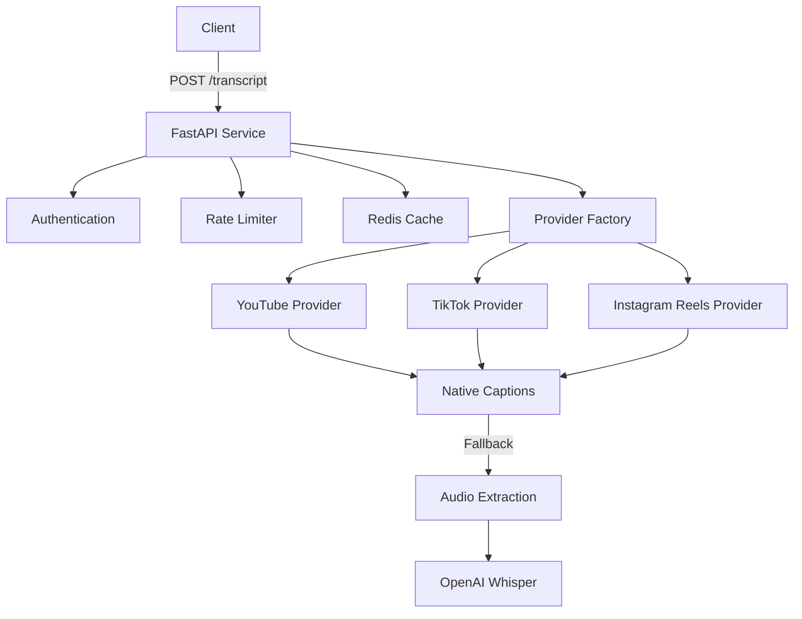

# Transcript API

A production-ready FastAPI service that provides transcripts for videos from multiple providers (YouTube, TikTok, and Instagram Reels).

## Features

- Single unified API endpoint for multiple video platforms
- Native caption extraction when available
- Fallback to audio extraction + OpenAI Whisper transcription
- Built-in caching with Redis
- API key authentication
- Rate limiting per provider
- Comprehensive OpenAPI/Swagger documentation
- Docker support for easy deployment

## Architecture



## API Usage

### Request

```bash
curl -X POST http://localhost:8000/transcript \
  -H "Content-Type: application/json" \
  -H "X-API-Key: your-api-key" \
  -d '{
    "provider": "youtube",
    "video_url": "https://www.youtube.com/watch?v=dQw4w9WgXcQ"
  }'
```

### Response

```json
{
  "video_id": "dQw4w9WgXcQ",
  "provider": "youtube",
  "transcript": "Never gonna give you up...",
  "segments": [
    {
      "start": 0.0,
      "end": 3.2,
      "text": "Never gonna give you up"
    }
  ]
}
```

## Setup

1. Clone the repository:
   ```bash
   git clone https://github.com/yourusername/transcript-api.git
   cd transcript-api
   ```

2. Install dependencies:
   ```bash
   pip install -r requirements.txt
   ```

3. Set up environment variables:
   ```bash
   cp .env.example .env
   # Edit .env with your configuration
   ```

4. Run the service:
   ```bash
   uvicorn app.main:app --reload
   ```

5. Visit OpenAPI docs at http://localhost:8000/docs

## Docker Deployment

1. Build the image:
   ```bash
   docker build -t transcript-api .
   ```

2. Run with Docker Compose:
   ```bash
   docker-compose up -d
   ```

## Development

### Running Tests

```bash
pytest
```

### Code Style

```bash
black .
isort .
flake8
mypy .
```

## Adding New Providers

1. Create a new provider class in `app/providers/`
2. Implement the `BaseProvider` interface
3. Register the provider in the factory
4. Add tests

See `CONTRIBUTING.md` for detailed instructions.

## License

MIT 