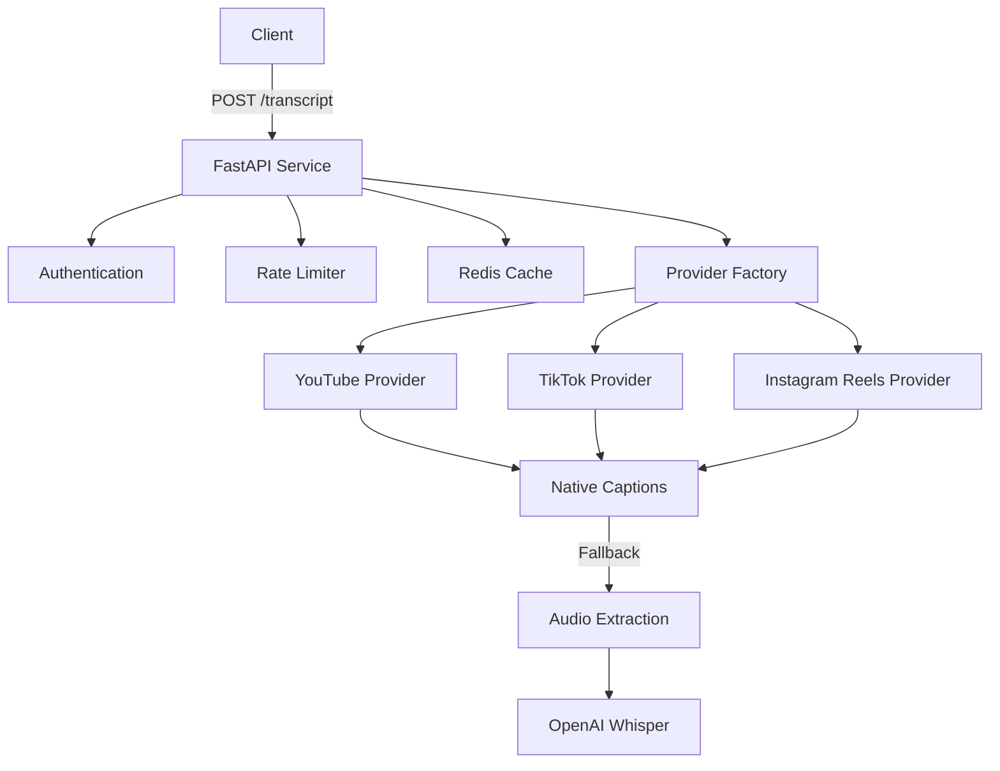

# Transcript API

A production-ready FastAPI service that provides transcripts for videos from multiple providers (YouTube, TikTok, and Instagram Reels).

## Features

- Single unified API endpoint for multiple video platforms
- Native caption extraction when available
- Fallback to audio extraction + OpenAI Whisper transcription
- Built-in caching with Redis
- API key authentication
- Rate limiting per provider
- Comprehensive OpenAPI/Swagger documentation
- Docker support for easy deployment

## Architecture



## API Usage

### Request

```bash
curl -X POST http://localhost:8000/transcript \
  -H "Content-Type: application/json" \
  -H "X-API-Key: your-api-key" \
  -d '{
    "provider": "youtube",
    "video_url": "https://www.youtube.com/watch?v=dQw4w9WgXcQ"
  }'
```

### Response

```json
{
  "video_id": "dQw4w9WgXcQ",
  "provider": "youtube",
  "transcript": "Never gonna give you up...",
  "segments": [
    {
      "start": 0.0,
      "end": 3.2,
      "text": "Never gonna give you up"
    }
  ]
}
```

## Setup

1. Clone the repository:
   ```bash
   git clone https://github.com/yourusername/transcript-api.git
   cd transcript-api
   ```

2. Install dependencies:
   ```bash
   pip install -r requirements.txt
   ```

3. Set up environment variables:
   ```bash
   cp .env.example .env
   # Edit .env with your configuration
   ```

4. Run the service:
   ```bash
   uvicorn app.main:app --reload
   ```

5. Visit OpenAPI docs at http://localhost:8000/docs

## Docker Deployment

1. Build the image:
   ```bash
   docker build -t transcript-api .
   ```

2. Run with Docker Compose:
   ```bash
   docker-compose up -d
   ```

## Development

### Running Tests

```bash
pytest
```

### Code Style

```bash
black .
isort .
flake8
mypy .
```

## Adding New Providers

1. Create a new provider class in `app/providers/`
2. Implement the `BaseProvider` interface
3. Register the provider in the factory
4. Add tests

See `CONTRIBUTING.md` for detailed instructions.

## License

MIT 

## Deployment

This application is designed to be deployed using Docker and Docker Compose.

### Manual Deployment

Follow these steps to deploy the application manually on a Linux server:

1.  **Prerequisites**:
    *   Ensure Docker and Docker Compose are installed on your Linux server.
    *   Ensure Git is installed.

2.  **Clone the Repository**:
    ```bash
    git clone <your-repository-url>
    cd <your-project-directory>
    ```

3.  **Configure Environment Variables**:
    Create a `.env` file in the root of the project directory. This file will contain your sensitive credentials and configuration. Start by copying the example or creating it from scratch:
    ```bash
    cp .env.example .env 
    # Or create .env and paste the content below
    ```
    Populate it with the necessary values. Here's an example structure:

    ```dotenv
    # Security (Required)
    API_KEY=YOUR_API_KEY_HERE # Required - Change this!

    # Redis Configuration
    REDIS_HOST=redis # Internal to docker-compose, usually no need to change
    REDIS_PORT=6379 # Internal to docker-compose, usually no need to change
    REDIS_DB=0
    REDIS_PASSWORD= # Optional - Leave empty for no password

    # OpenAI (Optional - for Whisper fallback)
    OPENAI_API_KEY=YOUR_OPENAI_API_KEY_HERE # Optional - Required only if you want to use Whisper fallback

    # Provider-specific settings (Optional)
    TIKTOK_SESSION_ID=YOUR_TIKTOK_SESSION_ID_HERE # Optional - Required for TikTok private videos
    INSTAGRAM_USERNAME=YOUR_INSTAGRAM_USERNAME_HERE # Optional - Required for Instagram private videos
    INSTAGRAM_PASSWORD=YOUR_INSTAGRAM_PASSWORD_HERE # Optional - Required for Instagram private videos

    # Rate Limiting (requests per hour)
    # These are example values, adjust them according to your needs.
    # pydantic-settings will parse these into the RATE_LIMIT_MAX_REQUESTS dictionary.
    RATE_LIMIT_WINDOW=3600
    RATE_LIMIT_MAX_REQUESTS_YOUTUBE=100
    RATE_LIMIT_MAX_REQUESTS_TIKTOK=50
    RATE_LIMIT_MAX_REQUESTS_REELS=30

    # API Settings (Usually no need to change these from defaults)
    # API_V1_STR=/api/v1
    # PROJECT_NAME=Transcript API
    # API_KEY_NAME=X-API-Key
    ```
    **Important**: Replace placeholder values like `YOUR_API_KEY_HERE` with your actual secrets. Ensure this `.env` file has appropriate permissions and is never committed to version control (it's already in `.gitignore`).

4.  **Build and Start the Services**:
    ```bash
    docker-compose build
    docker-compose up -d
    ```
    This will build the API image and start both the API and Redis services in detached mode.

5.  **Viewing Logs**:
    To view the logs from the API service (or all services):
    ```bash
    docker-compose logs -f api
    # For all services
    # docker-compose logs -f
    ```

6.  **Stopping the Services**:
    ```bash
    docker-compose down
    ```

### Automated Deployment with GitHub Actions

This project includes a GitHub Actions workflow (`.github/workflows/deploy.yml`) to automate deployment to a Linux server via SSH when changes are pushed to the `main` branch.

1.  **Prerequisites on the Server**:
    *   Git installed.
    *   Docker and Docker Compose installed.
    *   An SSH user that can execute Docker commands and has write access to the target deployment directory.
    *   The `.env` configuration file (as described in the Manual Deployment section) must be created and populated in the target deployment directory on the server *before* the first automated deployment. The workflow checks for its existence but does not create or manage its content.

2.  **GitHub Repository Secrets Configuration**:
    Before the workflow can run successfully, you must configure the following secrets in your GitHub repository settings (Settings > Secrets and variables > Actions > New repository secret):
    *   `SSH_HOST`: The IP address or hostname of your deployment server.
    *   `SSH_USER`: The username used for SSH login to your server.
    *   `SSH_PRIVATE_KEY`: The private SSH key (not the public key) that corresponds to the `SSH_USER`. This key should be configured on your server to allow passwordless login for the `SSH_USER`.
    *   `SSH_TARGET_DIR`: The absolute path on your server where the application code will be checked out and run (e.g., `/home/youruser/my-transcript-api`).

3.  **Workflow Details**:
    *   The workflow triggers on pushes to the `main` branch.
    *   It uses the `webfactory/ssh-agent` action to handle SSH key authentication.
    *   It automatically adds the server's SSH host key to `known_hosts` using `ssh-keyscan` to prevent interactive prompts.
    *   On the server, it performs the following:
        *   Navigates to `SSH_TARGET_DIR`.
        *   Pulls the latest code from the `main` branch.
        *   Verifies the `.env` file exists.
        *   Pulls the latest `redis` image (or any other external images defined in `docker-compose.yml`).
        *   Stops existing services using `docker-compose down --remove-orphans`.
        *   Rebuilds the `api` service image using `docker-compose build api`.
        *   Starts all services using `docker-compose up -d`.

4.  **First Deployment Note**:
    While `ssh-keyscan` is used, it's good practice to manually SSH into your server from your local machine (or any machine) at least once before relying on the GitHub Action. This allows you to verify the SSH connection and accept the server's host fingerprint if prompted. The GitHub Action attempts to handle this non-interactively.